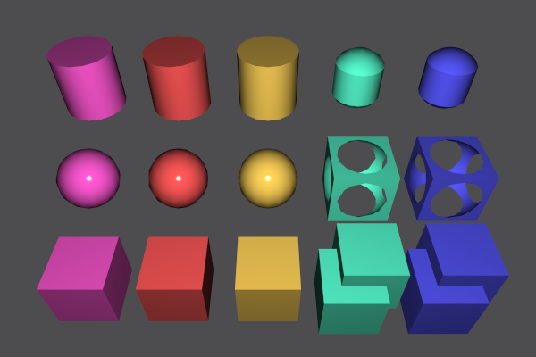

# QtCSG

Constructive Solid Geometry (CSG) is a modeling technique that uses Boolean
operations like union and intersection to combine 3D solids. This library
implements CSG operations on meshes elegantly and concisely using BSP trees,
and is meant to serve as an easily understandable implementation of the
algorithm. All edge cases involving overlapping coplanar polygons in both
solids are correctly handled.

This library is a direct port of [csg.js](https://github.com/evanw/csg.js)
to Qt and Qt3D. All the hard work has been done by Evan Wallace. He also
wrote the original documentation.

## Example Usage

    const auto cube = QtCSG::cube{};
    const auto sphere = QtCSG::sphere{{}, 1.3};
    const auto polygons = (cube - sphere).polygons();

Create a Qt3D mesh:

    const auto cube = QtCSG::cube{};
    const auto sphere = QtCSG::sphere{{}, 1.3};
    const auto mesh = Qt3DCSG::Mesh{cube & sphere};

To convert a Qt3D geometry into a QtSCG geometry simply call `QtCSG::Geometry`.

## Implementation Details

All CSG operations are implemented in terms of two functions, `clipTo()` and
`invert()`, which remove parts of a BSP tree inside another BSP tree and swap
solid and empty space, respectively. To find the union of `a` and `b`, we
want to remove everything in `a` inside `b` and everything in `b` inside `a`,
then combine polygons from `a` and `b` into one solid:

    a.clipTo(b);
    b.clipTo(a);
    a.build(b.allPolygons());

The only tricky part is handling overlapping coplanar polygons in both trees.
The code above keeps both copies, but we need to keep them in one tree and
remove them in the other tree. To remove them from `b` we can clip the
inverse of `b` against `a`. The code for union now looks like this:

    a.clipTo(b);
    b.clipTo(a);
    b.invert();
    b.clipTo(a);
    b.invert();
    a.build(b.allPolygons());

Subtraction and intersection naturally follow from set operations.
If union is `A | B`, subtraction is `A - B = ~(~A | B)` and intersection
is `A & B = ~(~A | ~B)` where `~` is the complement operator.

## Project structure

The project is structured using folders:

* qtcsg — the actual Qt port of csg.js; it only depends on QtGui
* qt3dcsg — this library allows to use CSG in Qt3D; it depends on Qt3DRender
* qtcsgdemo — a tiny program demonstrating this library's features
* tests — some initial docs

## Building

To build install a recent version of [Qt SDK](https://qt.io/).
Build from command line using CMake, or simply open `CMakeList.txt`
in the QtCreator.

The code has been tested with Qt 5.15 and Qt 6.2.

## Legal Notice

Unless otherwise noted, QtCSG is provided under the terms of the
[GNU General Public License v3.0 or later](COPYING-GPL3.md).

As an exception to this, the following files are provided under the 
terms of the [revised BSD 3-Clause License](docs/licenses/BSD-3-Clause-KDAB.md):

- [robustwireframe.frag](demo/shaders/gl3/robustwireframe.frag)
- [robustwireframe.geom](demo/shaders/gl3/robustwireframe.geom)
- [robustwireframe.vert](demo/shaders/gl3/robustwireframe.vert)

As with any licensing, the license offered here is a starting point
for negotiations. Contact me if this offer doesn't work for you:

    Mathias Hasselmann <mathias+qtcsg@taschenorakel.de>

